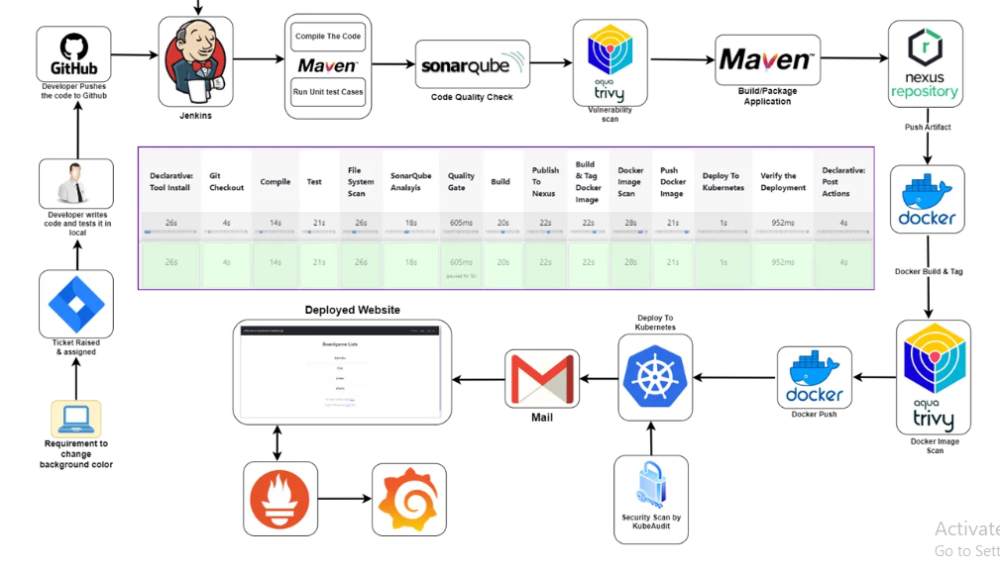
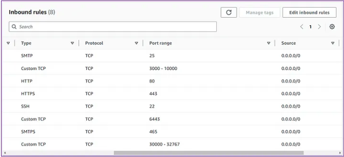
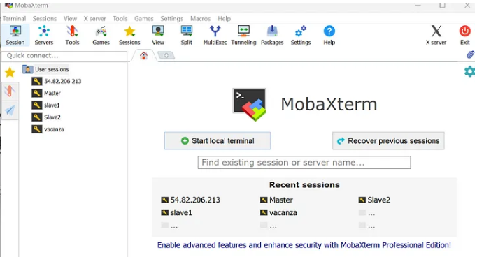

PHASE-1 | Setup Infra

To create an Ubuntu EC2 instance in AWS, follow these steps:

1. Sign in to the AWS Management Console:

Go to the AWS Management Console at https://aws.amazon.com/console/.

Sign in with your AWS account credentials.

2. Navigate to EC2:

Once logged in, navigate to the EC2 dashboard by typing “EC2” in the search bar at the top or by selecting “Services” and then “EC2” under the “Compute” section.

3. Launch Ec2 Instance:

Click on the “Instances” link in the EC2 dashboard sidebar.

Click the “Launch Instance” button.

4. Choose an Amazon Machine Image (AMI):

In the “Step 1: Choose an Amazon Machine Image (AMI)” section, select “Ubuntu” from the list of available AMIs.

Choose the Ubuntu version you want to use. For example, “Ubuntu Server 20.04 LTS”.

Click “Select”.

5. Choose an Instance Type:

In the “Step 2: Choose an Instance Type” section, select the instance type that fits your requirements. The default option (usually a t2.micro instance) is suitable for testing and small workloads.

Click “Next: Configure Instance Details”.

6. Configure Instance Details:

Optionally, configure instance details such as network settings, subnets, IAM role, etc. You can leave these settings as default for now.

Click “Next: Add Storage”.

7. Add Storage:

Specify the size of the root volume (default is usually fine for testing purposes).

Click “Next: Add Tags”.

8. Add Tags:

Optionally, add tags to your instance for better organization and management.

Click “Next: Configure Security Group”.

9. Configure Security Group:

In the “Step 6: Configure Security Group” section, configure the security group to allow SSH access (port 22) from your IP address.

You may also want to allow other ports based on your requirements (e.g., HTTP, HTTPS) as in this pic

Click “Review and Launch”.

10. Review and Launch:

Review the configuration of your instance.

Click “Launch”.

11. Select Key Pair:

In the pop-up window, select an existing key pair or create a new one.

Check the acknowledgment box.

Click “Launch Instances”.

12. Access Your Instance:

Use Mobaxterm

Setup K8-Cluster using kubeadm [K8 Version →1.28.1]
1. Update System Packages [On Master & Worker Node]

sudo apt-get update

2. Install Docker[On Master & Worker Node]
 
~~~ Bash
sudo apt update
#Install Required Packages for Docker: Install packages to allow apt to use a repository over HTTPS:
sudo apt install apt-transport-https ca-certificates curl software-properties-common -y

#Add Docker’s Official GPG Key: Add Docker’s official GPG key to ensure the authenticity of the software package:
curl -fsSL https://download.docker.com/linux/ubuntu/gpg | sudo apt-key add -

#Set Up the Docker Repository: Add the Docker repository to your system's APT sources
sudo add-apt-repository "deb [arch=amd64] https://download.docker.com/linux/ubuntu $(lsb_release -cs) stable"

#Update the Package Database with Docker Packages: Update the apt package index again:
sudo apt update

#Install Docker: Now, you can install Docker from the Docker repository:
sudo apt install docker-ce -y

#Check Docker Version: To verify that Docker is installed correctly, you can check its version:
docker --version

#Manage Docker as a Non-root User (Optional): If you want to run Docker commands without using sudo, add your user to the docker group:
sudo usermod -aG docker ${USER}
~~~
3. Install Required Dependencies for Kubernetes[On Master & Worker Node]

~~~Bash

#disable swap
sudo swapoff -a

# Create the .conf file to load the modules at bootup
cat <<EOF | sudo tee /etc/modules-load.d/k8s.conf
overlay
br_netfilter
EOF

sudo modprobe overlay
sudo modprobe br_netfilter

# sysctl params required by setup, params persist across reboots
cat <<EOF | sudo tee /etc/sysctl.d/k8s.conf
net.bridge.bridge-nf-call-iptables  = 1
net.bridge.bridge-nf-call-ip6tables = 1
net.ipv4.ip_forward                 = 1
EOF

# Apply sysctl params without reboot
sudo sysctl --system

## Install CRIO Runtime
sudo apt-get update -y
sudo apt-get install -y software-properties-common curl apt-transport-https ca-certificates gpg

sudo curl -fsSL https://pkgs.k8s.io/addons:/cri-o:/prerelease:/main/deb/Release.key | sudo gpg --dearmor -o /etc/apt/keyrings/cri-o-apt-keyring.gpg
echo "deb [signed-by=/etc/apt/keyrings/cri-o-apt-keyring.gpg] https://pkgs.k8s.io/addons:/cri-o:/prerelease:/main/deb/ /" | sudo tee /etc/apt/sources.list.d/cri-o.list

sudo apt-get update -y
sudo apt-get install -y cri-o

sudo systemctl daemon-reload
sudo systemctl enable crio --now
sudo systemctl start crio.service

echo "CRI runtime installed successfully"

# Add Kubernetes APT repository and install required packages
curl -fsSL https://pkgs.k8s.io/core:/stable:/v1.29/deb/Release.key | sudo gpg --dearmor -o /etc/apt/keyrings/kubernetes-apt-keyring.gpg
echo 'deb [signed-by=/etc/apt/keyrings/kubernetes-apt-keyring.gpg] https://pkgs.k8s.io/core:/stable:/v1.29/deb/ /' | sudo tee /etc/apt/sources.list.d/kubernetes.list

sudo apt-get update -y
sudo apt-get install -y kubelet="1.29.0-*" kubectl="1.29.0-*" kubeadm="1.29.0-*"
sudo apt-get update -y
sudo apt-get install -y jq

sudo systemctl enable --now kubelet
sudo systemctl start kubelet
~~~

Note :- If you are getting the error which is given below , then use command.

4. Update Package List[On Master & Worker Node]

sudo apt update

5. Initialize Kubernetes Master Node [On MasterNode]

sudo kubeadm init — pod-network-cidr=10.244.0.0/16

8. Configure Kubernetes Cluster [On MasterNode]

mkdir -p $HOME/.kube

sudo cp -i /etc/kubernetes/admin.conf $HOME/.kube/config sudo chown $(id -u):$(id -g) $HOME/.kube/config

9. Deploy Networking Solution (Calico) [On MasterNode]

kubectl apply -f https://docs.projectcalico.org/v3.20/manifests/calico.yaml

10. Deploy Ingress Controller (NGINX) [On MasterNode]

kubectl apply -f https://raw.githubusercontent.com/kubernetes/ingress- nginx/controller-v0.49.0/deploy/static/provider/baremetal/deploy.yaml

Installing Jenkins on Ubuntu

~~~Bash
#!/bin/bash
# Install OpenJDK 17 JRE Headless
sudo apt install openjdk-17-jre-headless -y
# Download Jenkins GPG key
sudo wget -O /usr/share/keyrings/jenkins-keyring.asc \ https://pkg.jenkins.io/debian-stable/jenkins.io-2023.key
# Add Jenkins repository to package manager sources
echo deb [signed-by=/usr/share/keyrings/jenkins-keyring.asc] \ https://pkg.jenkins.io/debian-stable binary/ | sudo tee \
/etc/apt/sources.list.d/jenkins.list > /dev/null
# Update package manager repositories sudo apt-get update
# Install Jenkins
sudo apt-get install jenkins -y
~~~

Save this script in a file, for example, install_jenkins.sh, and make it executable using:

chmod +x install_jenkins.sh

Then, you can run the script using:

./install_jenkins.sh

This script will automate the installation process of OpenJDK 17 JRE Headless and Jenkins.

Install docker for future use

~~~Bash
#!/bin/bash
# Update package manager repositories sudo apt-get update
# Install necessary dependencies
sudo apt-get install -y ca-certificates curl
# Create directory for Docker GPG key sudo install -m 0755 -d /etc/apt/keyrings
# Download Docker's GPG key
sudo curl -fsSL https://download.docker.com/linux/ubuntu/gpg -o
/etc/apt/keyrings/docker.asc
# Ensure proper permissions for the key sudo chmod a+r /etc/apt/keyrings/docker.asc
# Add Docker repository to Apt sources
echo "deb [arch=$(dpkg - print-architecture) signed- by=/etc/apt/keyrings/docker.asc] https://download.docker.com/linux/ubuntu \
$(. /etc/os-release && echo "$VERSION_CODENAME") stable" | \ sudo tee /etc/apt/sources.list.d/docker.list > /dev/null
# Update package manager repositories sudo apt-get update
sudo apt-get install -y docker-ce docker-ce-cli containerd.io docker-buildx-plugin docker-compose-plugin
~~~

Save this script in a file, for example, install_docker.sh, and make it executable using:

chmod +x install_docker.sh

Then, you can run the script using:

./install_docker.sh

SetUp Nexus

~~~Bash
#!/bin/bash
# Update package manager repositories sudo apt-get update
# Install necessary dependencies
sudo apt-get install -y ca-certificates curl
# Create directory for Docker GPG key sudo install -m 0755 -d /etc/apt/keyrings
# Download Docker's GPG key
sudo curl -fsSL https://download.docker.com/linux/ubuntu/gpg -o
/etc/apt/keyrings/docker.asc
# Ensure proper permissions for the key sudo chmod a+r /etc/apt/keyrings/docker.asc
# Add Docker repository to Apt sources
echo "deb [arch=$(dpkg - print-architecture) signed- by=/etc/apt/keyrings/docker.asc] https://download.docker.com/linux/ubuntu \
$(. /etc/os-release && echo "$VERSION_CODENAME") stable" | \ sudo tee /etc/apt/sources.list.d/docker.list > /dev/null
# Update package manager repositories sudo apt-get update
sudo apt-get install -y docker-ce docker-ce-cli containerd.io docker-buildx-plugin docker-compose-plugin
~~~

Save this script in a file, for example, install_docker.sh, and make it executable using:

chmod +x install_docker.sh

Then, you can run the script using:

./install_docker.sh

Create Nexus using docker container

To create a Docker container running Nexus 3 and exposing it on port 8081, you can use the following command:

docker run -d — name nexus -p 8081:8081 sonatype/nexus3:latest

This command does the following:

· -d: Detaches the container and runs it in the background.

· — name nexus: Specifies the name of the container as “nexus”.

· -p 8081:8081: Maps port 8081 on the host to port 8081 on the container, allowing access to Nexus through port 8081.

· sonatype/nexus3:latest: Specifies the Docker image to use for the container, in this case, the latest version of Nexus 3 from the Sonatype repository.

After running this command, Nexus will be accessible on your host machine at http://IP:8081.

Get Nexus initial password

Your provided commands are correct for accessing the Nexus password stored in the container. Here’s a breakdown of the steps:

1. Get Container ID: You need to find out the ID of the Nexus container. You can do this by running:

docker ps

This command lists all running containers along with their IDs, among other information.

2. Access Container’s Bash Shell: Once you have the container ID, you can execute the docker exec command to access the container’s bash shell: docker exec -it <container_ID> /bin/bash

Replace <container_ID> with the actual ID of the Nexus container.

3. Navigate to Nexus Directory: Inside the container’s bash shell, navigate to the directory where Nexus stores its configuration:

cd sonatype-work/nexus3

4. View Admin Password: Finally, you can view the admin password by displaying the contents of the admin.password file:

cat admin.password

5. Exit the Container Shell: Once you have retrieved the password, you can exit the container’s bash shell:

exit

This process allows you to access the Nexus admin password stored within the container. Make sure to keep this password secure, as it grants administrative access to your Nexus instance.

SetUp SonarQube

~~~Bash
#!/bin/bash
# Update package manager repositories sudo apt-get update
# Install necessary dependencies
sudo apt-get install -y ca-certificates curl
# Create directory for Docker GPG key sudo install -m 0755 -d /etc/apt/keyrings
# Download Docker's GPG key
sudo curl -fsSL https://download.docker.com/linux/ubuntu/gpg -o
/etc/apt/keyrings/docker.asc
# Ensure proper permissions for the key sudo chmod a+r /etc/apt/keyrings/docker.asc
# Add Docker repository to Apt sources
echo "deb [arch=$(dpkg - print-architecture) signed- by=/etc/apt/keyrings/docker.asc] https://download.docker.com/linux/ubuntu \
$(. /etc/os-release && echo "$VERSION_CODENAME") stable" | \ sudo tee /etc/apt/sources.list.d/docker.list > /dev/null
# Update package manager repositories sudo apt-get update
sudo apt-get install -y docker-ce docker-ce-cli containerd.io docker-buildx-plugin docker-compose-plugin
~~~

Save this script in a file, for example, install_docker.sh, and make it executable using:

chmod +x install_docker.sh

Then, you can run the script using:

./install_docker.sh

Create Sonarqube Docker container

To run SonarQube in a Docker container with the provided command, you can follow these steps:

1. Open your terminal or command prompt.

2. Run the following command:

docker run -d — name sonar -p 9000:9000 sonarqube:lts-community

This command will download the sonarqube:lts-community Docker image from Docker Hub if it’s not already available locally. Then, it will create a container named “sonar”

from this image, running it in detached mode (-d flag) and mapping port 9000 on the host machine to port 9000 in the container (-p 9000:9000 flag).

3. Access SonarQube by opening a web browser and navigating to http://VmIP:9000.

This will start the SonarQube server, and you should be able to access it using the provided URL. If you’re running Docker on a remote server or a different port, replace localhost with the appropriate hostname or IP address and adjust the port accordingly.

#### PHASE-2 | Private Git Setup
Steps to create a private Git repository, generate a personal access token, connect to the repository, and push code to it:

1. Create a Private Git Repository:

Go to your preferred Git hosting platform (e.g., GitHub, GitLab, Bitbucket).

Log in to your account or sign up if you don’t have one.

Create a new repository and set it as private.

2 Generate a Personal Access Token:

Navigate to your account settings or profile settings.

Look for the “Developer settings” or “Personal access tokens” section.

Generate a new token, providing it with the necessary permissions (e.g., repo access).

3. Clone the Repository Locally:

Open Git Bash or your terminal.

Navigate to the directory where you want to clone the repository.

Use the git clone command followed by the repository’s URL. For example:

git clone <repository_URL>

4. Replace <repository_URL> with the URL of your private repository.

5. Add Your Source Code Files:

Navigate into the cloned repository directory.

Paste your source code files or create new ones inside this directory.

6. Stage and Commit Changes:

Use the git add command to stage the changes:

git add .

Use the git commit command to commit the staged changes along with a meaningful message:

git commit -m “Your commit message here”

7. Push Changes to the Repository:

Use the git push command to push your committed changes to the remote repository:

git push

If it’s your first time pushing to this repository, you might need to specify the remote and branch:

git push -u origin master

8. Replace master with the branch name if you’re pushing to a different branch.

9. Enter Personal Access Token as Authentication:

When prompted for credentials during the push, enter your username (usually your email) and use your personal access token as the password.

By following these steps, you’ll be able to create a private Git repository, connect to it using Git Bash, and push your code changes securely using a personal access token for authentication.

#### PHASE-3 | CICD
Install below Plugins in Jenkins

1. Eclipse Temurin Installer:

This plugin enables Jenkins to automatically install and configure the Eclipse Temurin JDK (formerly known as AdoptOpenJDK).

To install, go to Jenkins dashboard -> Manage Jenkins -> Manage Plugins -> Available tab.

Search for “Eclipse Temurin Installer” and select it.

Click on the “Install without restart” button.

2. Pipeline Maven Integration:

This plugin provides Maven support for Jenkins Pipeline.

It allows you to use Maven commands directly within your Jenkins Pipeline scripts.

To install, follow the same steps as above, but search for “Pipeline Maven Integration” instead.

3. Config File Provider:

This plugin allows you to define configuration files (e.g., properties, XML, JSON) centrally in Jenkins.

These configurations can then be referenced and used by your Jenkins jobs.

Install it using the same procedure as mentioned earlier.

4. SonarQube Scanner:

SonarQube is a code quality and security analysis tool.

This plugin integrates Jenkins with SonarQube by providing a scanner that analyzes code during builds.

You can install it from the Jenkins plugin manager as described above.

5. Kubernetes CLI:

This plugin allows Jenkins to interact with Kubernetes clusters using the Kubernetes command-line tool (kubectl).

It’s useful for tasks like deploying applications to Kubernetes from Jenkins jobs.

Install it through the plugin manager.

6. Kubernetes:

This plugin integrates Jenkins with Kubernetes by allowing Jenkins agents to run as pods within a Kubernetes cluster.

It provides dynamic scaling and resource optimization capabilities for Jenkins builds.

Install it from the Jenkins plugin manager.

7. Docker:

This plugin allows Jenkins to interact with Docker, enabling Docker builds and integration with Docker registries.

You can use it to build Docker images, run Docker containers, and push/pull images from Docker registries.

Install it from the plugin manager.

8. Docker Pipeline Step:

This plugin extends Jenkins Pipeline with steps to build, publish, and run Docker containers as part of your Pipeline scripts.

It provides a convenient way to manage Docker containers directly from Jenkins Pipelines.

Install it through the plugin manager like the others.

After installing these plugins, you may need to configure them according to your specific environment and requirements. This typically involves setting up credentials, configuring paths, and specifying options in Jenkins global configuration or individual job configurations. Each plugin usually comes with its own set of documentation to guide you through the configuration process.

Configure Above Plugins in Jenkins Pipeline

~~~Bash
pipeline { agent any
tools {
jdk 'jdk17'
maven 'maven3'
}
enviornment {
SCANNER_HOME= tool 'sonar-scanner'
}
stages {
stage('Git Checkout') {
steps {
git branch: 'main', credentialsId: 'git-cred', url: 'https://github.com/jaiswaladi246/Boardgame.git'
}
}
stage('Compile') { steps {
sh "mvn compile"
}
}
stage('Test') { steps {
sh "mvn test"
}
}
stage('File System Scan') { steps {
sh "trivy fs - format table -o trivy-fs-report.html ."
}
}
stage('SonarQube Analsyis') { steps {
withSonarQubeEnv('sonar') {
sh ''' $SCANNER_HOME/bin/sonar-scanner - Dsonar.projectName=BoardGame -Dsonar.projectKey=BoardGame \
-Dsonar.java.binaries=. '''
}
}
}
stage('Quality Gate') { steps {
script {
waitForQualityGate abortPipeline: false, credentialsId: 'sonar-token'
}
}
}
stage('Build') { steps {
sh "mvn package"
}
}
stage('Publish To Nexus') { steps {
withMaven(globalMavenSettingsConfig: 'global-settings', jdk: 'jdk17', maven: 'maven3', mavenSettingsConfig: '', traceability: true) {
sh "mvn deploy"
}
}
}
stage('Build & Tag Docker Image') { steps {
script {
withDockerRegistry(credentialsId: 'docker-cred', toolName: 'docker') { sh "docker build -t adijaiswal/boardshack:latest ."
}
}
}
}
stage('Docker Image Scan') { steps {
sh "trivy image - format table -o trivy-image-report.html adijaiswal/boardshack:latest "
}
}
stage('Push Docker Image') { steps {
script {
withDockerRegistry(credentialsId: 'docker-cred', toolName: 'docker') { sh "docker push adijaiswal/boardshack:latest"
}
}
}
}
stage('Deploy To Kubernetes') { steps {
withKubeConfig(caCertificate: '', clusterName: 'kubernetes', contextName: '', credentialsId: 'k8-cred', namespace: 'webapps', restrictKubeConfigAccess: false, serverUrl: 'https://172.31.8.146:6443') {
sh "kubectl apply -f deployment-service.yaml"
}
}
}
stage('Verify the Deployment') { steps {
withKubeConfig(caCertificate: '', clusterName: 'kubernetes', contextName: '', credentialsId: 'k8-cred', namespace: 'webapps', restrictKubeConfigAccess: false, serverUrl: 'https://172.31.8.146:6443') {
sh "kubectl get pods -n webapps"
sh "kubectl get svc -n webapps"
}
}
}
}
post { always {
script {
def jobName = env.JOB_NAME
def buildNumber = env.BUILD_NUMBER
def pipelineStatus = currentBuild.result ?: 'UNKNOWN'
def bannerColor = pipelineStatus.toUpperCase() == 'SUCCESS' ? 'green' : 'red'
def body = """
<html>
<body>

10px;">
<h2>${jobName} - Build ${buildNumber}</h2>

Pipeline Status:
${pipelineStatus.toUpperCase()}</h3>

Check the <a href="${BUILD_URL}">console
output</a>.

"""

</body>
</html>
emailext (
subject: "${jobName} - Build ${buildNumber} -
${pipelineStatus.toUpperCase()}", body: body,
to: 'thakurrajesh22293@gmail.com', from: 'jenkins@example.com', replyTo: 'jenkins@example.com', mimeType: 'text/html',
attachmentsPattern: 'trivy-image-report.html'
)
}
}
}
}
~~~

PHASE-3 | Monitoring
Highly recomended to follow the steps shown in video
Links to download Prometheus, Node_Exporter & black Box exporter https://prometheus.io/download/

Links to download
Grafana https://grafana.com/grafana/download

Other link from
video https://github.com/prometheus/blackbox_exporter